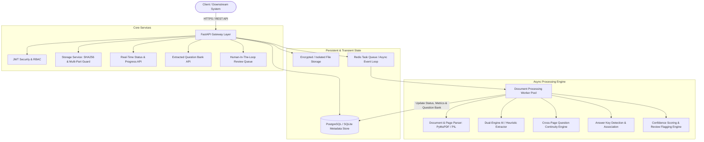
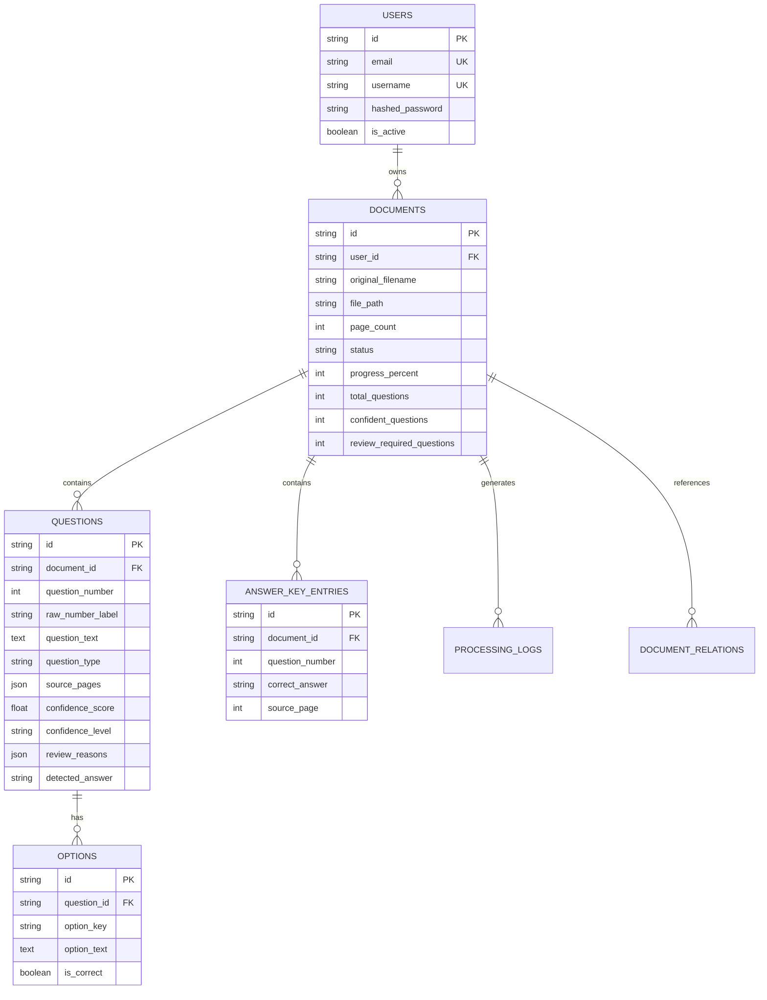

# Architecture & Design Documentation
## Pragati Bharati Document Intelligence & Question Extraction Service

---

## 1. Overall System Architecture

The service is structured as a resilient, asynchronous, event-driven microservice designed for high throughput, fault tolerance, and flexible AI/OCR ingestion.

---

## 2. Document-Processing Approach

1. **Ingestion & Guardrails**:
   - Files are uploaded through multi-part form requests.
   - Guardrails immediately validate MIME types, extensions (`pdf`, `png`, `jpg`, `jpeg`), and enforce file size caps (`MAX_FILE_SIZE_MB=50`).
   - Files are persisted with unique collision-resistant UUIDs preventing path traversal.
   - An initial document record is inserted into the database with `PENDING` status, and an HTTP `202 Accepted` response is returned immediately to the client with `document_id` and tracking metadata.

2. **Parsing Pipeline**:
   - **PyMuPDF (`pymupdf`)**: Extracts layout blocks, font sizes, bounding boxes, and raw text page by page with high throughput.
   - **Page Character Density Analysis**: The parser calculates text density per page. If text density is below threshold (<30 characters per page), the document is identified as a scanned or image-based document and flagged for vision-based extraction or human review.
   - **Image Rendering**: Supports on-demand rendering of PDF pages into high-resolution PNG pixmaps for side-by-side verification in the visual dashboard.

---

## 3. OCR & AI Technology Choices

To ensure both **100% immediate out-of-the-box evaluation** and **state-of-the-art vision extraction**, the architecture implements a **Dual-Engine Strategy**:

| Feature | Primary Engine (AI Vision) | Secondary Engine (Built-In Heuristic State Machine) |
|---|---|---|
| **Technology** | Google Gemini Flash / OpenAI Vision API | PyMuPDF + RegEx Deterministic State Machine |
| **Use Case** | Messy scans, rotated pages, handwriting, diagrams | Digital PDFs, clean formatted question banks, offline environments |
| **Dependencies** | Requires API Key in `.env` | Pure Python, zero external binary or cloud requirement |
| **Speed** | 2-4 seconds per document | <100 milliseconds per document |
| **Fallback Behavior** | Automatically falls back to secondary engine if API key is missing or request times out | Always available |

---

## 4. Storage Design

The data model is normalized to enable high write performance and complex downstream relational querying:

---

## 5. Asynchronous Processing Strategy

To support high-concurrency workloads and prevent HTTP request timeouts:
1. **Asynchronous Hand-off**: The API endpoint immediately enqueues the processing job.
2. **Worker Abstraction**:
   - **Production (Distributed)**: Uses Redis as a distributed message broker with concurrent worker consumers.
   - **Local Development / Standalone**: Automatically falls back to non-blocking `asyncio` background tasks when Redis is not running, ensuring developers can test without starting Redis.
3. **Idempotency**: Processing pipelines delete stale question entries before re-inserting during document reprocessing, ensuring idempotent retries.

---

## 6. Question Extraction & Cross-Page Continuity Strategy

Question banks often feature complex layouts where a question begins on Page $N$ and its options or continuation text spill onto Page $N+1$.

### State-Machine Transitions
1. **Header Detection**: Matches prefixes such as `1.`, `Q1.`, `Question 1:`, `1)`.
2. **Option Detection**: Matches option tokens `A)`, `(A)`, `A.`, `[A]` and associates them with the active question.
3. **Continuation Stitching**:
   - If lines are encountered without a new question number header:
     - If inside an option, line is appended to that option.
     - If before options, line is appended to the question body.
   - When a page break occurs without encountering a new question header, the question continues across the boundary, automatically registering `source_pages=[N, N+1]` and setting the audit flag `split_across_pages`.

---

## 7. Answer-Key Association Engine

The service supports 3 distinct answer key topologies:
1. **Inline End-of-Document Keys**: Detected automatically via section headers (`Answer Key`, `Solutions`, `Answers`).
2. **Standalone Answer Key Files**: A dedicated document uploaded with role `ANSWER_KEY` can be associated with a question paper via `POST /api/v1/documents/{id}/relate`.
3. **Uncertainty Flagging**: If a question has no matching answer key entry, the system marks `answer_source="UNMATCHED"` and tags the question with `unmatched_answer_key`, preventing false positive assignments.

---

## 8. Confidence Scoring & Review Queue

Every question is assigned a normalized confidence score between `0.0` and `1.0` based on objective criteria:

| Metric | Deduction | Condition |
|---|---|---|
| Question Text Length | -0.3 | Length < 10 characters |
| Option Completeness | -0.2 | MCQ with fewer than 4 options |
| Cross-Page Continuity | -0.1 | Spanning across multiple pages |
| Missing Question Number | -0.3 | Number absent in raw layout |
| Unmatched Answer Key | -0.15 | No corresponding answer key entry |
| Scanned / Low Quality | -0.5 | Document flagged as low-density scan |

### Confidence Levels
- `CONFIDENT` ($\ge 0.8$): Ready for automated ingestion into examination systems.
- `PARTIAL` ($0.5 \le \text{score} < 0.8$): Extracted but has minor anomalies (e.g. 3 options instead of 4).
- `NEEDS_REVIEW` ($< 0.5$): Pushed into the human reviewer queue. Reviewers can approve or modify questions via `PUT /api/v1/review/questions/{id}`.

---

## 9. Security & Scalability

- **Authentication**: Stateless JWT Bearer tokens with configurable expiration (`ACCESS_TOKEN_EXPIRE_MINUTES`).
- **Authorization Isolation**: Multi-tenant isolation ensuring users can only read, update, or preview documents they own.
- **Storage Isolation**: Stored file names are randomized UUIDs, preventing file overwrites or path traversal attacks.
- **Horizontal Scalability**: Stateless FastAPI web layer can be scaled across multiple container replicas behind a load balancer (Nginx / ALB) with PostgreSQL and Redis handling shared state.

---

## 10. Trade-Offs & Limitations

1. **OCR without Tesseract**: Standard Windows development environments often lack system-level Tesseract binaries. Our dual-engine architecture solves this by pairing PyMuPDF layout analysis with external multi-modal AI vision, ensuring seamless functionality anywhere.
2. **Tabular and Complex Math Formats**: Complex LaTeX or nested matrix tables are preserved as raw structured text. When Gemini Flash is enabled, LaTeX formulas are automatically normalized into clean standard notation.
